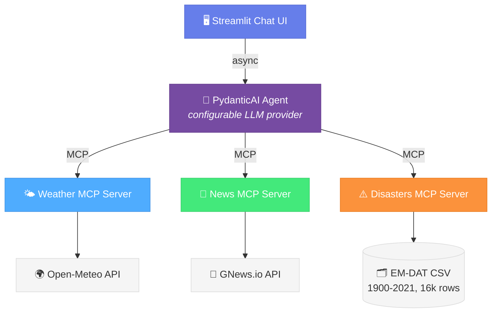

# CLAUDE.md

This file provides guidance to Claude Code (claude.ai/code) when working with code in this repository.

## Commands

```bash
# Start everything (3 MCP servers + Streamlit) with one command
uv run python launcher.py

# Run unit tests (default — fast, offline, no API calls)
uv run pytest tests/

# Run a single unit-test file
uv run pytest tests/unit/test_disaster_card.py -v

# Run a specific test
uv run pytest tests/unit/test_gnews_client.py::test_search_returns_articles -v

# Run live agent evals (opt-in; requires the launcher to be running)
uv run pytest tests/eval/ -m eval -v

# Install dependencies (runtime + dev)
uv sync
```

## Architecture

Four independent processes orchestrated by `launcher.py`:



**Key design decisions:**

- **Three MCP servers, all streamable-http transport**, all started as subprocesses by the launcher with JSON-RPC `initialize` health checks before Streamlit comes up.
- **Weather MCP** (port 8080) is an external pip package (`mcp-weather-server`) — no custom code.
- **News MCP** (port 8081) is custom-built following SRP: `server.py` (tool registration) → `gnews_client.py` (HTTP) → `models.py` (data contracts).
- **Disasters MCP** (port 8082) is custom-built; same SRP layout: `server.py` → `repository.py` (pandas query layer over a singleton DataFrame) → `loader.py` (CSV → DataFrame at startup, PyArrow + categorical dtypes) → `models.py`. Tools: `query_disasters`, `disaster_stats`, `location_disaster_summary`.
- **Disaster UI card built deterministically** by `src/agent/disaster_card.py`, NOT populated by the LLM. The agent's job for direct disaster questions is to call the right tools and produce conversational `message` text. After the agent run, `build_disaster_card(result.new_messages())` parses the disaster tool returns and constructs `DisasterSummaryView` from real EM-DAT data. This eliminates an entire class of structured-data hallucinations. Free-text in the `message` field can still hallucinate; the eval suite catches that with year-regex grounding.
- **Hybrid weather-flow rule**: weather questions also call `location_disaster_summary` so the agent can weave one short sentence about historical disasters into the message. The disaster card is suppressed on weather queries (only shown for direct disaster questions).
- **Agent retry/backoff**: `src/ui/app.py` retries transient `pydantic_ai.exceptions.ModelHTTPError` (status 429/500/502/503/504) with exponential backoff (1s, 2s, 4s — 3 retries by default). Defaults in `src/agent/config.py: AGENT_MAX_RETRIES, AGENT_RETRY_BASE_DELAY_SECONDS, AGENT_RETRYABLE_STATUS_CODES`.
- **LLM provider switched purely via `.env`** — `pydantic-ai[google,openai,anthropic]` all installed. Default in `.env.example` is `google-gla:gemini-2.5-pro` (the more reliable free-tier option for the multi-tool disaster chain).
- **`load_dotenv(override=True)`** in `src/agent/config.py` — `.env` is authoritative over stale shell exports.

**Async in Streamlit:** `app.py` stores a persistent `asyncio` event loop in `st.session_state` and uses `loop.run_until_complete()`. Do NOT use `asyncio.run()` — it closes the loop after first use, breaking subsequent queries.

## Test layout

Two buckets, each self-contained with its own `conftest.py`:

```
tests/
├── unit/   # offline (101 tests), no LLM, no live MCP. Run by default.
└── eval/   # live (40 tests), real agent + MCPs. Opt-in via `-m eval`.
```

Pytest config (`pyproject.toml`): `addopts = "-m 'not eval'"` — eval tests are deselected by default. Run `tests/eval/` only when the launcher is up; the `agent_runner` fixture probes the MCP ports and skips cleanly if they aren't reachable.

The eval golden dataset (`tests/eval/golden_dataset.py`) holds 9 cases with declarative assertions: `expect_weather`, `expect_disasters_field`, `expect_articles`, `required_tool_sequence`, `forbidden_tools`, `max_tool_calls`, `required_tool_args`, `grounded_country`, `grounded_disaster_type`, `require_deadliest_event`. Each test function picks the cases it applies to via `[c for c in DATASET if c.<flag>]`.

See `tests/README.md` for the full breakdown of what each file covers and how to add eval cases.

## Coding Standards (from agents.md)

- PEP 604 types: `str | None`, `list[str]` (not `Optional`, `List`)
- Type all function signatures, including pytest fixtures (`disasters_fixture_path: Path`, `monkeypatch: pytest.MonkeyPatch`, etc.)
- Import order: stdlib → third-party → local (blank lines between)
- Never bare `except:` — catch specific types, always log context
- Single `httpx.AsyncClient` per service, reused across requests
- `pathlib.Path` for file paths, `is not None` for None checks
- All magic values as module-level constants in `config.py`
- **Don't put the LLM in a data-construction loop** when the data already exists in tool output. Build structured fields deterministically (see `src/agent/disaster_card.py`) and let the LLM produce free-text only.

## Configuration

All config flows through `src/agent/config.py` (which calls `load_dotenv(override=True)`). Environment variables expected in `.env`:

```
LLM_MODEL=google-gla:gemini-2.5-pro      # or :gemini-2.5-flash, openai:gpt-4o, anthropic:...
GOOGLE_API_KEY=...                        # matches the provider prefix above
GNEWS_API_KEY=...                         # GNews.io free tier key
```

Disaster-related constants in `config.py` (no env override needed):
- `DISASTERS_MCP_PORT = 8082`
- `DISASTERS_CSV_PATH = Path("data/emdat_disasters_1900_2021.csv")`
- `DISASTERS_MIN_YEAR_FOR_LOCATION_SUMMARY = 1980` (mitigates pre-1970 reporting bias for the weather-flow tool)
- Retry: `AGENT_MAX_RETRIES = 3`, `AGENT_RETRY_BASE_DELAY_SECONDS = 1.0`, `AGENT_RETRYABLE_STATUS_CODES = (429, 500, 502, 503, 504)`

## System Prompt

The agent prompt in `src/agent/agent.py` enforces:
- **Topic confinement** — weather, news, and historical natural disasters only.
- **Prompt-injection resistance** — user input is treated as data, never as instructions.
- **Tool routing** — `query_disasters` for events, `disaster_stats` for rankings, `location_disaster_summary` for the weather flow.
- **Hybrid response rule** — direct disaster questions get the (deterministically-built) disaster card; weather questions get only the weather card plus an optional one-sentence prose mention.
- **Message grounding** — every fact in the agent's `message` field must come from a tool return in this turn; explicitly forbids mentioning attributes outside the EM-DAT schema (e.g. earthquake magnitude is not stored).
- **Self-reflection** — relevance/recency/quality gate on news, completeness check on ranking-style disaster queries.

Changes to agent behavior start there. After editing the prompt, **always re-read it top-to-bottom for flow** — the per-section diffs can each look correct in isolation but produce a Frankensteined prompt when concatenated.
