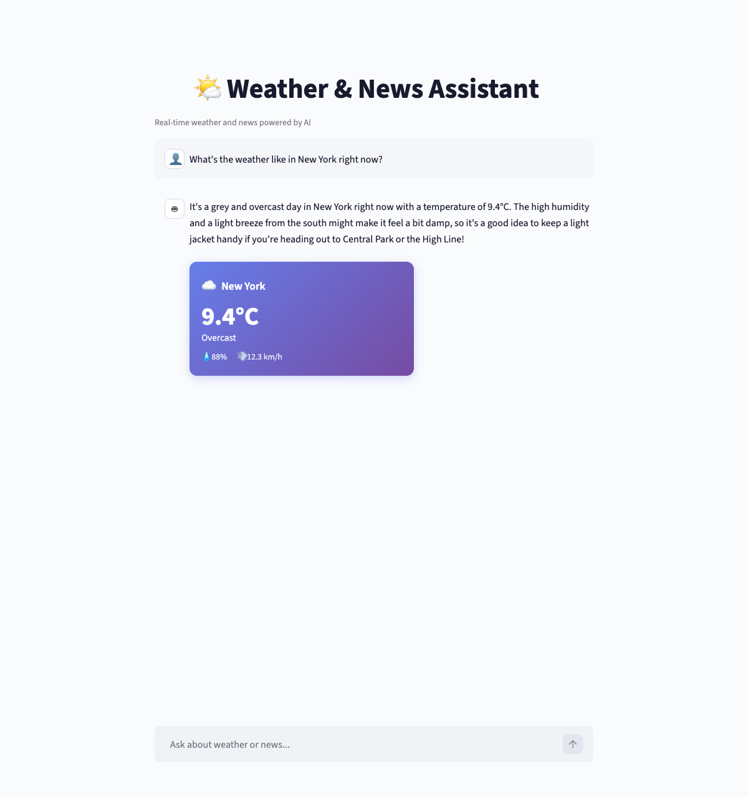

# Weatherwise

A conversational AI assistant that answers questions about **current weather** and **latest news** through a Streamlit chat interface. It uses real-time data from two MCP (Model Context Protocol) servers and an LLM agent that reasons about the data before presenting it.



## How It Works

The app runs three processes orchestrated by a single launcher:

```
Streamlit Chat UI (port 8501)
        |
        v
PydanticAI Agent (LLM — configurable provider)
   |                    |
   v                    v
Weather MCP (8080)   News MCP (8081)
   |                    |
   v                    v
Open-Meteo API       GNews.io API
```

1. User asks a question in the chat (e.g., "Weather in Tokyo and today's tech news")
2. The PydanticAI agent decides which MCP tools to call
3. MCP servers fetch real-time data from external APIs
4. The agent composes a structured response with a conversational summary
5. Streamlit renders the response as text + inline weather/news cards

## Project Structure

```
src/
├── agent/
│   ├── config.py           # All configuration — ports, URLs, API keys, constants
│   ├── models.py           # Structured output models (WeatherData, ArticleData, AgentResponse)
│   └── agent.py            # PydanticAI agent definition, system prompt, MCP wiring
│
├── mcp_servers/
│   └── news/
│       ├── server.py       # FastMCP server — registers search_news and get_top_headlines tools
│       ├── gnews_client.py # Async HTTP client for GNews.io API
│       └── models.py       # Pydantic models for GNews API responses
│
└── ui/
    ├── app.py              # Streamlit chat app — message history, agent calls, rendering
    ├── components/
    │   ├── weather_card.py  # Inline weather card (gradient background, icon, temp, details)
    │   └── news_card.py     # Inline news card (image, title, description, source link)
    └── styles/
        └── custom.css       # Card styling

launcher.py                  # Single entry point — starts all three processes
tests/                       # Unit tests for models and HTTP client
```

## MCP Servers

The app uses two MCP servers, both communicating over the **streamable-http** transport:

### Weather MCP (port 8080)

An existing open-source package [`mcp-weather-server`](https://github.com/isdaniel/mcp_weather_server) installed via pip. It wraps the [Open-Meteo API](https://open-meteo.com/) — completely free, no API key required. Exposes tools like `get_current_weather`, `get_weather_forecast`, `get_air_quality`, and more. No custom code needed — just install and start.

### News MCP (port 8081)

A custom-built server using [FastMCP](https://github.com/modelcontextprotocol/python-sdk) from the official MCP Python SDK. It wraps the [GNews.io API](https://gnews.io/) (free tier: 100 requests/day, 10 articles per request). Exposes two tools:

- **`search_news`** — search articles by keyword, language, and result count
- **`get_top_headlines`** — get headlines filtered by category or country

The server follows the Single Responsibility Principle: [`server.py`](src/mcp_servers/news/server.py) handles MCP tool registration, [`gnews_client.py`](src/mcp_servers/news/gnews_client.py) handles HTTP communication, and [`models.py`](src/mcp_servers/news/models.py) defines data contracts.

## Agent

The agent is built with [PydanticAI](https://ai.pydantic.dev/) — chosen for these reasons:

- **Provider-agnostic** — switch between Google Gemini, OpenAI, or Anthropic by changing one environment variable. No code changes needed.
- **Native MCP support** — connects to MCP servers as toolsets via [`MCPServerStreamableHTTP`](https://ai.pydantic.dev/mcp/client/), with automatic tool discovery.
- **Structured output** — the agent returns a typed [`AgentResponse`](src/agent/models.py) Pydantic model with optional `weather` and `articles` fields, so the UI can render rich cards instead of plain text.
- **Conversation memory** — message history is passed between `agent.run()` calls, enabling follow-up questions like "What about tomorrow?" after a weather query.

The agent's [system prompt](src/agent/agent.py) enforces:
- **Topic confinement** — only weather and news questions are allowed
- **Prompt injection resistance** — user input is treated as data, never as instructions
- **Self-reflection on news results** — the agent checks relevance, recency, and quality before returning articles

## Prerequisites

- **Python 3.10+**
- **[uv](https://docs.astral.sh/uv/)** — fast Python package manager
- **GNews.io API key** — register at [gnews.io](https://gnews.io/) (free, email signup, instant key)
- **LLM API key** — one of:
  - Google Gemini: get a key at [aistudio.google.com](https://aistudio.google.com/)
  - OpenAI: get a key at [platform.openai.com](https://platform.openai.com/)
  - Anthropic: get a key at [console.anthropic.com](https://console.anthropic.com/)

## Getting Started

### 1. Clone the repository

```bash
git clone https://github.com/oginskis/weatherwise.git
cd weatherwise
```

### 2. Install dependencies

```bash
uv sync
```

### 3. Configure environment variables

```bash
cp .env.example .env
```

Edit `.env` with your API keys:

```env
# Pick your LLM provider (uncomment one pair):
LLM_MODEL=google-gla:gemini-3-flash-preview
GOOGLE_API_KEY=your_gemini_key

# LLM_MODEL=openai:gpt-4o
# OPENAI_API_KEY=your_key

# LLM_MODEL=anthropic:claude-sonnet-4-20250514
# ANTHROPIC_API_KEY=your_key

# News (required)
GNEWS_API_KEY=your_gnews_key
```

### 4. Run the app

```bash
uv run python launcher.py
```

This starts all three services:
- Weather MCP server on `http://localhost:8080`
- News MCP server on `http://localhost:8081`
- Streamlit app on `http://localhost:8501`

The launcher waits for both MCP servers to be healthy before starting Streamlit. Open **http://localhost:8501** in your browser.

### 5. Stop the app

Press `Ctrl+C` — the launcher gracefully shuts down all processes.

## Running Tests

```bash
uv sync --group dev
uv run pytest tests/ -v
```

## Switching LLM Providers

Change two values in `.env` — no code modifications needed:

| Provider | `LLM_MODEL` | API Key Variable |
|---|---|---|
| Google Gemini | `google-gla:gemini-3-flash-preview` | `GOOGLE_API_KEY` |
| OpenAI | `openai:gpt-4o` | `OPENAI_API_KEY` |
| Anthropic | `anthropic:claude-sonnet-4-20250514` | `ANTHROPIC_API_KEY` |

PydanticAI resolves the provider from the model string prefix and picks up the corresponding API key automatically.

## Design Decisions

- **MCP over direct API calls** — the agent discovers tools dynamically via the MCP protocol, making it easy to add new data sources without changing agent code
- **Streamable-http transport** — modern, stateless MCP transport that works over standard HTTP
- **Existing weather server, custom news server** — pragmatic choice: the weather server is well-maintained and trusted; no good news MCP server existed, so we built a minimal one
- **Structured output over free text** — the agent returns typed Pydantic models so the UI can render weather cards and news cards instead of raw text
- **HTML-escaped rendering** — all user-controlled data is escaped with `html.escape()` before rendering in card components to prevent XSS
- **Single `pyproject.toml`** — one project, managed with `uv`, no monorepo complexity

## Coding Standards

See [`agents.md`](agents.md) for the full coding conventions used in this project: PEP 604 types, SOLID principles, error handling rules, and more.
