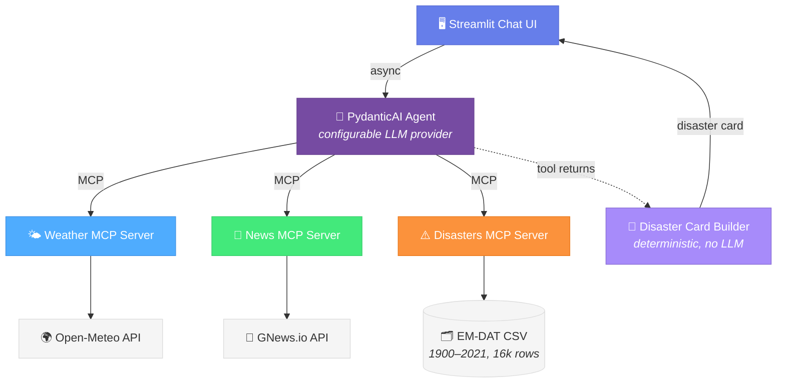

# Weatherwise

A conversational AI assistant that answers questions about **current weather**, **latest news**, and **historical natural disasters** through a Streamlit chat interface. It uses real-time data from three MCP (Model Context Protocol) servers and a PydanticAI agent that reasons about the data before presenting it.


## How It Works

The app consists of four processes orchestrated by a single launcher:



1. User asks a question in the chat (e.g., "Weather in Tokyo", "What were the deadliest earthquakes?", "Today's tech news")
2. The PydanticAI agent decides which MCP tools to call
3. MCP servers fetch real-time / historical data from external APIs and the local CSV
4. The agent composes a structured response with a conversational summary
5. A deterministic card builder reads the agent's tool returns and constructs the disaster card from real data — the LLM never paraphrases numbers (eliminates hallucinated counts and event names)
6. Streamlit renders text + inline weather, news, and disaster cards

## Project Structure

```
src/
├── agent/
│   ├── config.py             # All configuration — ports, URLs, API keys, retry settings, CSV path
│   ├── models.py             # AgentResponse (message, weather, articles), DisasterSummaryView for the card
│   ├── disaster_card.py      # Deterministic disaster card builder — reads tool returns, builds card without LLM
│   └── agent.py              # PydanticAI agent definition, system prompt, MCP wiring
│
├── mcp_servers/
│   ├── news/
│   │   ├── server.py         # FastMCP — search_news, get_top_headlines
│   │   ├── gnews_client.py   # Async HTTP client for GNews.io
│   │   └── models.py         # Pydantic models for GNews API responses
│   │
│   └── disasters/
│       ├── server.py         # FastMCP — query_disasters, disaster_stats, location_disaster_summary
│       ├── repository.py     # pandas query layer over the EM-DAT DataFrame (singleton)
│       ├── loader.py         # CSV → DataFrame at startup (PyArrow + categorical dtypes, lat/lon parsing)
│       └── models.py         # Pydantic response contracts (DisasterEvent, QueryResponse, etc.)
│
└── ui/
    ├── app.py                # Streamlit chat — message history, agent calls, retry/backoff, rendering
    ├── components/
    │   ├── weather_card.py   # Weather card (icon, temp, details)
    │   ├── news_card.py      # News card (image, title, source link)
    │   └── disaster_card.py  # Disaster card (event count, time span, top types, deadliest event)
    └── styles/
        └── custom.css        # Card styling

data/
└── emdat_disasters_1900_2021.csv   # EM-DAT dataset, 16,126 rows × 45 columns

launcher.py                   # Single entry point — starts all four processes (3 MCPs + Streamlit)
tests/                        # Unit + eval test suites — see tests/README.md
```

## MCP Servers

The app uses three MCP servers, all communicating over the **streamable-http** transport.

### Weather MCP (port 8080)

Existing open-source package [`mcp-weather-server`](https://github.com/isdaniel/mcp_weather_server) wrapping the [Open-Meteo API](https://open-meteo.com/) — completely free, no API key required. Exposes `get_current_weather`, `get_weather_forecast`, `get_air_quality`, etc.

### News MCP (port 8081)

Custom FastMCP server wrapping the [GNews.io API](https://gnews.io/) (free tier: 100 requests/day, 10 articles per request). Tools:

- **`search_news`** — search articles by keyword, language, and result count
- **`get_top_headlines`** — get headlines filtered by category or country

### Disasters MCP (port 8082)

Custom FastMCP server backed by the local [EM-DAT](https://www.emdat.be/) disasters dataset (`data/emdat_disasters_1900_2021.csv`, 16k rows). Loaded once at startup into pandas with PyArrow string backend and categorical dtypes for low-vocab columns. Tools:

- **`query_disasters`** — list specific events (filters: country, disaster type, location substring, year range)
- **`disaster_stats`** — group/rank by year, decade, type, country, or continent; metrics: count, total deaths, total damages
- **`location_disaster_summary`** — compact per-location summary (defaults to 1980+ to mitigate pre-1970 reporting bias). Used by the agent in the **weather flow** to add a one-sentence historical-disaster mention when a region has notable history.

The disasters MCP follows the news server's SRP layout: [`server.py`](src/mcp_servers/disasters/server.py) registers tools, [`repository.py`](src/mcp_servers/disasters/repository.py) holds the pandas query logic, [`loader.py`](src/mcp_servers/disasters/loader.py) handles CSV ingestion + cleanup, [`models.py`](src/mcp_servers/disasters/models.py) defines data contracts.

## Agent

Built with [PydanticAI](https://ai.pydantic.dev/). Reasons for the choice:

- **Provider-agnostic** — switch Google Gemini / OpenAI / Anthropic by changing one environment variable
- **Native MCP support** — connects to MCP servers as toolsets via `MCPServerStreamableHTTP`, with automatic tool discovery
- **Structured output** — returns a typed [`AgentResponse`](src/agent/models.py) (message, weather, articles)
- **Conversation memory** — message history is passed across turns

The agent's [system prompt](src/agent/agent.py) enforces:
- **Topic confinement** — only weather, news, and historical natural disasters
- **Prompt injection resistance** — user input is treated as data, never as instructions
- **Tool routing** — `query_disasters` for events, `disaster_stats` for rankings, `location_disaster_summary` for the weather flow
- **Hybrid response rule** — direct disaster questions get the disaster card; weather questions get only the weather card plus an optional one-sentence prose mention of disaster history (no card)
- **Self-reflection** — relevance/recency/quality check on news; grounding check on disaster facts in the message text

### Hallucination-resistant disaster card

A subtle architectural detail: the disaster UI card is **not** an LLM-emitted field on `AgentResponse`. Instead, after the agent's run completes, [`build_disaster_card`](src/agent/disaster_card.py) reads `result.new_messages()`, parses the JSON returns from the disaster tool calls, and constructs `DisasterSummaryView` directly from real EM-DAT data. This guarantees that every number, event name, and disaster type in the card matches what the tools actually returned — the LLM cannot paraphrase numbers into the card. Free-text in the `message` field can still hallucinate; the eval suite catches that with year-regex grounding checks.

### Resilience to transient API errors

`src/ui/app.py` wraps the agent call in an exponential-backoff retry loop for transient `ModelHTTPError` status codes (429/500/502/503/504). Defaults from `src/agent/config.py`: 3 retries, base delay 1s. After retries are exhausted, the UI shows a friendly message, not a stack trace.

## Prerequisites

- **Python 3.10+**
- **[uv](https://docs.astral.sh/uv/)** — fast Python package manager
- **GNews.io API key** — register at [gnews.io](https://gnews.io/) (free, instant)
- **LLM API key** — one of:
  - Google Gemini: [aistudio.google.com](https://aistudio.google.com/) (recommended: `gemini-2.5-pro`)
  - OpenAI: [platform.openai.com](https://platform.openai.com/)
  - Anthropic: [console.anthropic.com](https://console.anthropic.com/)
- **The EM-DAT CSV** — already included in the repo at `data/emdat_disasters_1900_2021.csv`

## Getting Started

### 1. Clone

```bash
git clone https://github.com/oginskis/weatherwise.git
cd weatherwise
```

### 2. Install dependencies

```bash
uv sync
```

This installs runtime + dev deps including `pandas>=2.2`, `pyarrow>=15`, `pydantic-ai`, and the `mcp` SDK.

### 3. Configure environment variables

```bash
cp .env.example .env
```

Edit `.env` with your API keys:

```env
# Pick your LLM provider:
LLM_MODEL=google-gla:gemini-2.5-pro
GOOGLE_API_KEY=your_gemini_key

# Or:
# LLM_MODEL=openai:gpt-4o
# OPENAI_API_KEY=your_key
# LLM_MODEL=anthropic:claude-sonnet-4-20250514
# ANTHROPIC_API_KEY=your_key

# News (required)
GNEWS_API_KEY=your_gnews_key
```

> **Note on shell env vars:** `src/agent/config.py` calls `load_dotenv(override=True)`, so `.env` is authoritative. If you previously set `LLM_MODEL` in your shell (`export LLM_MODEL=...`), `.env` now wins over it.

### 4. Run the app

```bash
uv run python launcher.py
```

Starts four services:
- Weather MCP on `http://localhost:8080`
- News MCP on `http://localhost:8081`
- Disasters MCP on `http://localhost:8082` (loads ~16k rows at startup)
- Streamlit on `http://localhost:8501`

The launcher health-checks each MCP via JSON-RPC `initialize` before starting Streamlit. Open **http://localhost:8501** in your browser.

### 5. Stop the app

`Ctrl+C` — the launcher gracefully terminates all subprocesses.

## Try It

Eight conversation starters in the UI, covering all primary behaviors:

**Weather** (hybrid rule may add a one-sentence disaster mention)
- 🌤️ *"What's the weather like in New York right now?"*
- 🗼 *"What's the current weather in Tokyo?"*

**News**
- 💻 *"What are the latest technology news headlines?"*
- 📈 *"What's happening in business news today?"*

**Disasters — aggregate / ranking**
- 🪨 *"What were the deadliest earthquakes ever recorded?"* — chains `disaster_stats` + `query_disasters`, returns disaster card with top types + deadliest event
- 🌊 *"Which decade had the most floods worldwide?"* — `disaster_stats(group_by="decade", disaster_type="Flood")`

**Disasters — scoped**
- 🌪️ *"What were the costliest storms in the United States?"* — chains stats by `total_damages_usd` + filtered query
- 🌎 *"What disasters happened in Haiti?"* — country-scoped event listing

## Running Tests

The suite is split into **offline unit tests** (default, fast) and **live evals** (opt-in, costs API quota).

```bash
# Offline: 101 unit tests, ~1s, no LLM, no MCP processes
uv run pytest tests/

# Live evals: 40 tests across grounding + trajectory checks.
# Start the launcher first (separate terminal), then:
uv run pytest tests/eval/ -v -m eval

# Subsets
uv run pytest tests/eval/ -m eval -k haiti_2010_event   # one case across all assertions
uv run pytest tests/eval/test_trajectory.py -m eval     # trajectory only
```

See [`tests/README.md`](tests/README.md) for full layout, what each file covers, and how to add new eval cases.

### Eval coverage

The 9-case golden dataset covers:
- Hybrid weather rule (Tokyo, Riga) — disaster card must NOT appear
- Decade aggregates (most floods worldwide)
- Deadliest / costliest queries with required tool chaining (`disaster_stats` → `query_disasters`)
- Location/year scoped queries (Haiti 2010)
- News-flow path
- Prompt injection refusal

Each case asserts on response shape (which fields are populated), tool trajectory (which tools were called, in what order, with what arguments, within what budget), and message-text grounding (every dataset-range year in the message must correspond to a real EM-DAT event under the case's filter).

## Switching LLM Providers

| Provider | `LLM_MODEL` | API Key Variable |
|---|---|---|
| Google Gemini (recommended) | `google-gla:gemini-2.5-pro` | `GOOGLE_API_KEY` |
| Google Gemini (cheaper) | `google-gla:gemini-2.5-flash` | `GOOGLE_API_KEY` |
| OpenAI | `openai:gpt-4o` | `OPENAI_API_KEY` |
| Anthropic | `anthropic:claude-sonnet-4-20250514` | `ANTHROPIC_API_KEY` |

PydanticAI resolves the provider from the model string prefix and picks up the corresponding key automatically.

## Design Decisions

- **MCP over direct API calls** — the agent discovers tools dynamically; new data sources can be added without changing agent code
- **Streamable-http transport** — modern, stateless MCP transport over standard HTTP; servers and agent can scale independently
- **Existing weather server, custom news + disasters servers** — reuse where solid, build where needed
- **Pandas + PyArrow + categorical dtypes** — modern Pandas 2.x idiom; load the EM-DAT CSV once into ~3 MB of memory, fast groupby/filter
- **Structured output over free text** — typed Pydantic models so the UI renders cards instead of raw text
- **Disaster card built deterministically, not by the LLM** — eliminates an entire class of structured-data hallucinations; only message text remains LLM-authored, and that's covered by eval grounding checks
- **Agent retry/backoff** — transient `ModelHTTPError` (429/503/etc.) is retried with exponential backoff before surfacing a friendly error
- **`load_dotenv(override=True)`** — `.env` is authoritative, immune to stale shell env vars
- **HTML-escaped rendering** — all user-controlled data passes through `html.escape()` before card markup
- **Single `pyproject.toml`** — one project, managed with `uv`, no monorepo complexity
- **Two-bucket test layout** — `tests/unit/` (offline, default) + `tests/eval/` (live, opt-in via `-m eval`); see [`tests/README.md`](tests/README.md)

## Coding Standards

See [`agents.md`](agents.md) for the full coding conventions: PEP 604 types, SOLID principles, error handling, etc.
